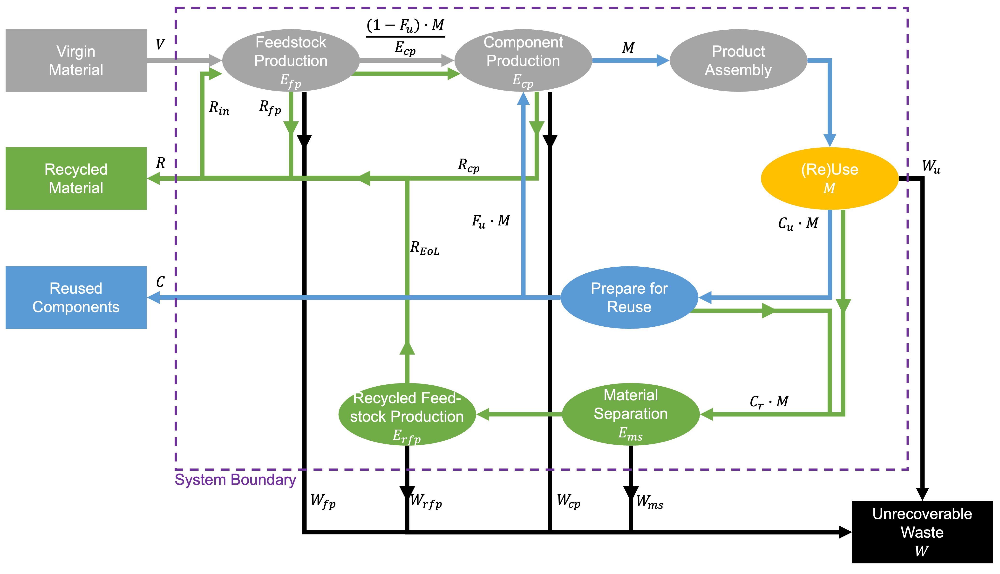

# PCI Circularity Calculator – Browser-based Tool

> ⚠️ **Work in progress:** This app evolves alongside the PCI methodology. Always sense-check results.

This browser-only tool reproduces the Product Circularity Indicator (PCI), Component Circularity Indicator (CCI), and Circularity Impact Indicator (CII) workflow from **PCI_paper_V2.pdf** (Sections 3–4 + Appendix A). Open `index.html` and you can enter, import, visualize, and export results without installing anything.



## Background

The workflow is adapted from Müller et al., *Assessing Product Circularity and Carbon Footprint: Electromagnetic Guard Locking System Case Study* (PCI_paper_V2.pdf). The tool follows:

- Section 3: Six-step integrated procedure for PCI + PCF assessments (v1 focuses on PCI/CCI/CII only).
- Section 4: Case study structure for handling components and hotspots.
- Appendix A: Equations 3–23 for PCI, CCI, CII, LFI, and all intermediate mass flows.

All UI field names map directly to Appendix A (`Fu`, `Fr`, `Efp`, `Ecp`, …). Percent inputs are entered as 0–100 and stored internally as fractions.

## 🧭 Choose your path

| Persona | Start here |
| --- | --- |
| 🆕 **Never used Git/GitHub** | Follow the “Download ZIP” steps below and open `index.html`. |
| 💼 **Product or design lead** | Use the ready-made CSVs in `/examples` to explore the case study immediately. |
| 🧑‍💻 **Engineer / Analyst** | Clone the repo, edit the code, or extend the math layer for PCF integration. |

## ✨ Highlights

- 🔌 **Zero-install**: double-click `index.html`; no build tools or servers.
- 📥 **CSV templates** for BoM and circularity parameters plus CSV export of working data and results.
- 🧮 **Built-in data grid** for manual entry with validation and sample components.
- 📊 **Chart.js visualizations** for CCI and CII per component.
- 🧠 **Defensive math layer** (`assets/js/circularity.js`) that implements Equations 3–23 with extensive JSDoc comments and optional debug logging.
- ⚠️ **Friendly status messages** and per-cell highlighting for invalid data (missing IDs, duplicate IDs, negative mass, out-of-range efficiencies, etc.).
- 📂 **Ready-to-use case-study CSVs** in `/examples` mirroring the paper’s data (load them via Step 2’s upload buttons to explore the full workflow instantly).
- 🌍 **Locale-aware exports**: pick your decimal separator (dot/comma) before downloading CSVs.

## 🧑‍🍳 Quick start recipes

### Option A – Download ZIP (Git-free)
1. Click the green **Code ▾ → Download ZIP** button in GitHub.
2. Unzip the archive (Windows: right-click → *Extract All...*; macOS: double-click).
3. Open the extracted folder and double-click `index.html`.
4. That’s it—your browser hosts the entire tool offline.

### Option B – Clone via Git
```bash
git clone https://github.com/<your-org>/pci.git
cd pci
open index.html   # macOS
# or
start index.html  # Windows PowerShell
```

### Try the paper’s dataset immediately
1. Go to **Step 2 – CSV mode**.
2. Click **Upload BoM CSV** and choose `examples/bom_case_study.csv`.
3. Click **Upload input-factors CSV** and choose `examples/input_factors_case_study.csv`.
4. Continue with Step 3 to replicate the case-study results.

## Quick start

1. Clone or download this repository.
2. Open `index.html` in a modern browser (Chrome, Edge, Firefox, Safari desktop or tablet).
3. Use the example data or import your own CSVs.
4. Click **Compute circularity indicators** to obtain PCI/CCI/CII and the charts.
5. Export BoM, factors, or results as CSV for documentation.

The interface is fully client-side, so no data leaves your machine.

## Workflow walkthrough

1. **Step 1 – Product parameters**: enter `Fu`, `Cu`, `Cr`, and the lifetime/use-intensity pairs (`L`, `Ld`, `I`, `Id`). These drive the use factor `X = (I · L) / (Id · Ld)` (Eq. 8).
2. **Step 2 – BoM & input factors**: either download the CSV templates or work directly in the Manual table. Columns map to the component inputs defined in Section 3.2. Prefer CSV mode? Use the templates or upload the case-study files from `/examples` (`bom_case_study.csv`, `input_factors_case_study.csv`) to reproduce the paper’s dataset.
3. **Step 3 – Calculation**: validates the grid and runs all equations from Appendix A, exposing per-component warnings (e.g., when CCI gets clamped to zero).
4. **Step 4 – Visualizations**: displays two bar charts (CCI and CII by component) using Chart.js.
5. **Step 5 – Export**: download your BoM, factor table, or the enriched results (CCI, CII, LFI, V/W/R flows).

## CSV formats

### BoM template

```csv
component_id,component_name,material,process,mass_kg
C1,Housing,Polyamide,Injection-molding,0.16
```

### Input-factor template

```csv
component_id,Fr_percent,Efp_percent,Ecp_percent,Cfp_percent,Ccp_percent,Ems_percent,Erfp_percent
C1,0,100,95,0,100,30,30
```

- Percent inputs are provided as 0–100 in the CSV, matching the UI. They are converted to fractions internally.
- Both templates can be downloaded directly from the UI and re-uploaded after editing in Excel, Sheets, or similar.

## Calculation details

- **PCI (Eq. 3 & 5)**: mass-weighted average of component CCIs plus the use-factor adjustment `PCI = 1 - (LFI / X)`. Negative PCI values are clamped to 0 as suggested in Appendix A.
- **CCI (Eq. 6)**: per-component version of PCI using the same `X`.
- **CII (Eq. 4)**: `CIIᵢ = 100 × (PCI / CCIᵢ) / Σ(PCI / CCIⱼ)`. When a CCI approaches zero the UI reports a warning and sets CII to zero to avoid divide-by-zero artifacts.
- **Linear Flow Index (Eq. 7)**: implemented with helper functions for:
  - Virgin feedstock mass `V` (Eq. 9)
  - Waste mass terms `W_fp`, `W_cp`, `W_u`, `W_ms`, `W_rfp` (Eq. 10–15)
  - Recycling flows `R_in`, `R_out` including `R_fp`, `R_cp`, `R_EoL` (Eq. 16–21)
  - Reused component mass `C` (Eq. 22)
  - Linear reference flows `V_linear`, `W_linear` (Eq. 23)
- **Debugging**: set `DEBUG_LOG` in `assets/js/app.js` to `true` to print intermediate flows (V, W, Rin/Rout, LFI) to the console for each component.

Variable naming aligns with the paper: `Fu`, `Cu`, `Cr`, `Fr`, `Efp`, `Ecp`, `Cfp`, `Ccp`, `Ems`, `Erfp`, `M`, and so on.

## Limitations & scope

- v1 focuses solely on PCI/CCI/CII. Hooks for PCF/LCA integration are not implemented yet but can be added in `app.js`.
- The UI assumes positive component masses and efficiency values within [0, 1]. Values outside that range are clamped or trigger validation errors.
- CSV parsing relies on Papa Parse when available; a lightweight fallback handles basic comma-separated files. Exotic quoting/encoding scenarios may require preprocessing.
- Charts and downloads run entirely client-side, so extremely large BoMs may feel slower on low-power devices.

## Development notes

- **Structure**
  - `index.html` – single-page layout with five steps.
  - `assets/css/styles.css` – responsive styling, table layout, status states.
  - `assets/js/app.js` – UI orchestration, validation, event handling, CSV wiring, and chart updates.
  - `assets/js/circularity.js` – pure math layer (no DOM), fully documented with the equation references.
  - `assets/js/csv-utils.js` – CSV template generation, parsing, and export helpers (using Papa Parse if present).
  - `assets/js/charts.js` – Chart.js wrapper for the two bar charts.
- **Extending the UI**: Add tabs/sections in `index.html`, style via `styles.css`, and wire new controls in `app.js`.
- **Adding metrics**: expand `circularity.js` with additional pure functions and import them into `app.js`. Keep new math functions pure and well-commented.
- **Debugging**: toggle `DEBUG_LOG` in `app.js` or inspect the `debug` object returned by `computeCircularityIndicators`.

## License

The project is released under the MIT License (see `LICENSE`). All methodology details remain credited to the authors of PCI_paper_V2.pdf.
